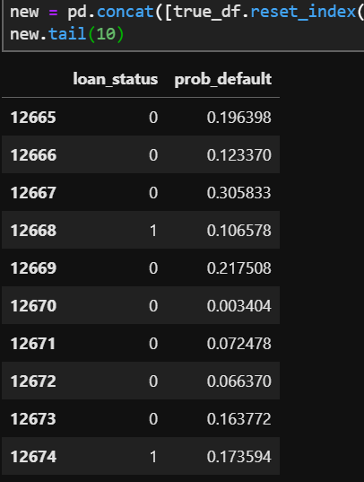
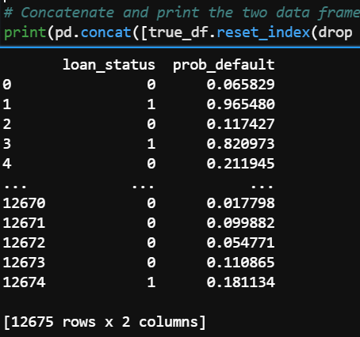
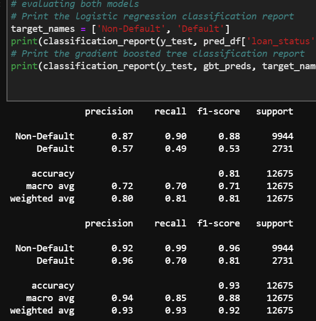
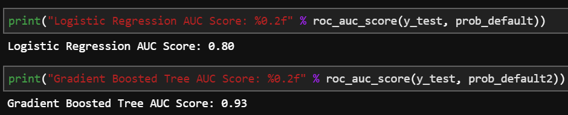
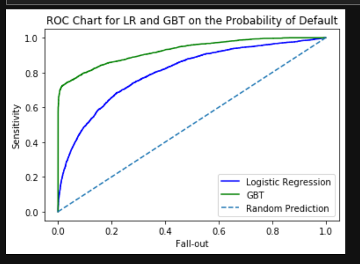
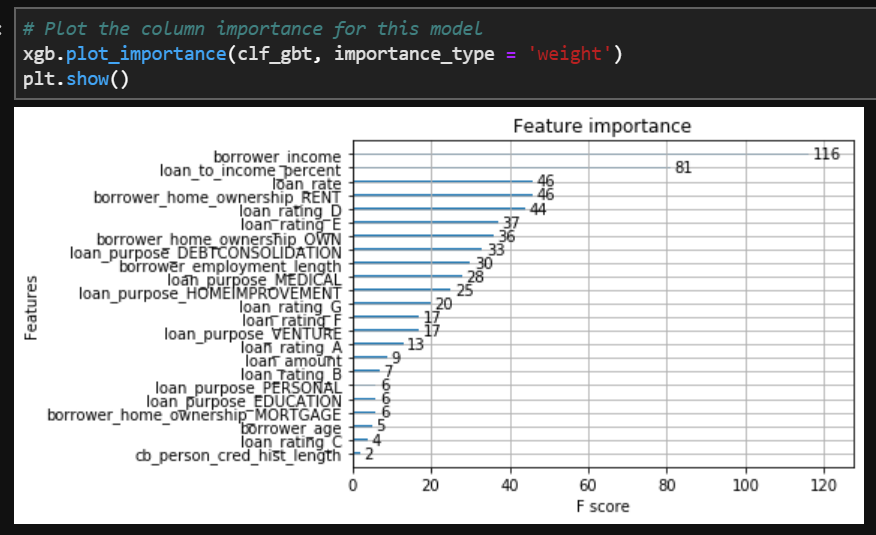

# Project-3
Loan default Forecasting

**Christian Stracke**

## Contents

1. [Goal & Motivation](#Motivation-&-Summary) 
2. [Approach & Steps](#Our-Approach)
3. [Data](#Data)
4. [Methods & Technology](#Methods-&-Technology)
5. [Model Evaluation](#Model-Evaluation)
6. [Discussion & Next Steps](#Discussion-&-NextSteps)

## 1. Goal & Motivation
This Project plans to evaluated two machine learning (ML) models in their accuracy of forecasting defaults and in particular the probability of defaults. 
The ML models that are being utilized and evaluated are Logistic Regression (LR) and the Gradient Boosting method XGBooster (XGB. The motivation of this project was to set up the a work flow that is part of a larger Loan Analytics Project. 
The Loan Analytics Project has the goal to perform valuations of Loan Portfolios utilizing not only the skills & tools acquired during the Columbia Fintech Coding bootcamp but also to keep expanding the skill set in python coding.

The forecast of probabilities of default (PD) is a crucial component in the valuation of loan portfolios as such that it is an input in the derivation of expected cash flows.

In this Project, we set up a python code that processes a sample loan tape (loan portfolio) with different loan attributes in order to forecast potential future defaults. 

## 2. Approach & Steps
Since the goal of the project to forecast probabilities, we selected the supervised learning approach where we would try to forecast probabilities of defaults using the models of LR and XGB. The final step in the approach is the evaluation of both models. The following are our work steps:

a) Cleaning , preparation and analysing of loan tape
b) Split the data into training and testing data subsets. 60% training, 40% testing
c) Train the models and predict probabiltities of default for each ML model, assess feature importance
d) Assess accuracy of both models using accuracy score, AUC score or ROC curve
e) Evaluate models and conclude on the most accurate model

## 3. Data

We obtained a sample loan tape from a work related project and took out all private date such as names, adresses or any personal information. The loans included in the loan tape are all perfonal loans that were issued for different purposes. The tape contains approximately 30k indiviual loans. The tape contains 13 features with one feature being "loan_status", which is being the binary target variable. "0" means the loan is performing. "1" means the loan is in default.
The other 12 features contain attorbutes such as, borrower employment length, borrowers income, loan to income ratio etc.

## 4. Methods & Technology

### Forecasting PD using LR & XGB
We had 12 features that represent loan attributes. Each of which will be analysed of its importance when forecasting PD. For the features, which came as non-numeric datatype (e.g. objects), we created dummy variables. After few more cleaning steps, we defined the loan_status feature column as target feature. Subsequently, we split the data into training and testing set. Out of the complete data set (cleaned), we decided to have 60% as training data set and the remaining 40% was utilized as testing data.
We then trained the data and predicted the probaibility of defaults based on the testing data:

Based on the initial results, we could already see that the XGB appeared to be more accurate in its predicting ability.
We went on to further evaluate both model by applying several evaluation & scoring methods in order to determine which ML method (LG or XGB) is the more superior method to use when forecasting PDs.

## 5. Model Evaluation

We ran the following scoring methods to evaluate the predicting power of LG and XGB:
a) classification report

b) AUC score

c) ROC Curve

Based on all three scorring methods, it became clear that the XGB Boosting model is more accurate in predicting PDs. In particular, measured by F1 score and the AUC (area under the ROC curve) showed significant better results for XGB than LG. In addition, we wanted to understand which of the features are the more crucial ones to predict PD utilizing XGB. We found that the personal income was the most important feature, which from, if you take a step back and think about personal loans, appears to be reasonable, given the income is the key source of income that is used to paypack personal loans. See below for the graph:

## 6. Discussion & Next Steps

We cleary identified the XGB model as the better model and therefore tend to use it on subsequent projects to forecast PDs of loans. Next steps for the Loan Analytics Project is to use the predicted PDs in order to calculat the expected loss of a loan (or loan portfolios), which can be calcualted using the PD * EAD (exposure at default) * LGD (loss given default). Once expected losses are calculated, they can be used as inputs when deriving expected cash flows of loans over the life of loans. Expected cash flows will be discounted using an appropriate yield that reflects the risk embedded in the expected cash flows. The present value of the expected cash flows represents the value of the loan (or loan portfolio) that can be used as an indication of what informed buyers and sellers of loan portfolios are willing to pay in a transaction. We already identified a github source (https://github.com/jdvelasq/cashflows), that we plan to test for the roll-out and calculation of expected cash flows of loans.

To be continued...

